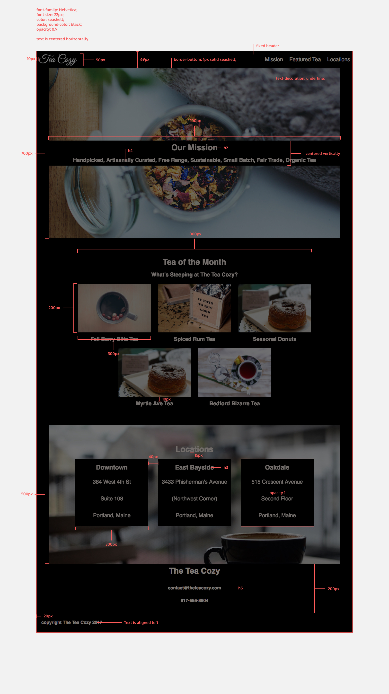

# Tea-Cozy

Codecademy Tea Cozy Project - The purpose of this project is to demonstrate HTML & CSS skills based on a design spec. This project assumes you can recreate the spec with little guidance.

_Note: The fourth image in the "Tea of the Month" section was replaced with the correct image and not the duplicated one in the spec._

## Technology

- HTML
- CSS
- CSS Flexbox Model
